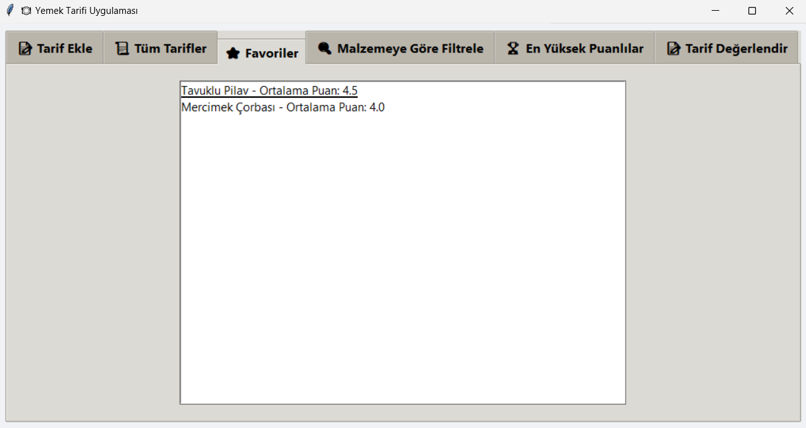

# 🚀 Python Proje Koleksiyonu

Bu repoda Python ve Tkinter kullanılarak geliştirilmiş 4 farklı masaüstü uygulaması bulunmaktadır. Her biri kullanıcı dostu arayüze ve temel veri işleme yeteneklerine sahiptir.

---

## 🚗 Araç Kiralama Sistemi

Araç kiralama işlemlerini kolaylaştırmak için geliştirilen bu uygulama ile müşteriler, araç bilgileri ve ödeme durumu yönetilebilir. JSON tabanlı veri kaydı ve ödeme takibi özellikleri içerir.

📌 Özellikler:
- Araç ve müşteri kaydı
- Kiralama ve teslim işlemleri
- Ödeme durumu takibi

🖼️ Görseller:

---

## 📚 Kütüphane Yönetim Sistemi

Kütüphaneler için geliştirilen bu sistem; kitapların, kullanıcıların ve ödünç alma işlemlerinin kolayca yönetilmesini sağlar. JSON dosyalarıyla veri saklama yapısı kullanır.

📌 Özellikler:
- Kitap ekleme, düzenleme ve silme
- Üye yönetimi
- Kitap ödünç alma ve iade sistemi

NOT: Kullanıcı adı "admin", şifre "admin123" girerek erişim sağlayabilirsiniz.

🖼️ Görseller:

---

## 🍽️ Restoran Sipariş ve Yönetim Sistemi

Restoranlarda sipariş almayı ve yönetmeyi kolaylaştırmak için geliştirilen bu sistem, hem kullanıcı hem de çalışan odaklı olarak tasarlanmıştır. Menü oluşturma, sipariş alma ve ödeme işlemleri içerir.

📌 Özellikler:
- Ürün yönetimi (ekleme, silme, güncelleme)
- Sipariş listesi ve ödeme işlemleri
- JSON ile veri kaydı ve yükleme

🖼️ Görseller:

---

## 🍲 Yemek Tarifi Uygulaması

Bu uygulama kullanıcıların yemek tariflerine göz atmasına, favorilerine eklemesine ve tarif aramasına olanak tanır. Filtreleme, sıralama ve kullanıcı dostu görsellik ile zenginleştirilmiştir.

📌 Özellikler:
- Tarif arama ve filtreleme
- En çok oy alan tarifleri listeleme
- Favorilere ekleme ve JSON tabanlı kayıt

🖼️ Görseller:

---

> 📁 Tüm projeler Python (Tkinter) ile geliştirilmiştir ve görsel odaklı masaüstü çözümleri sunar. Geri bildirimlere ve katkılara açıktır!